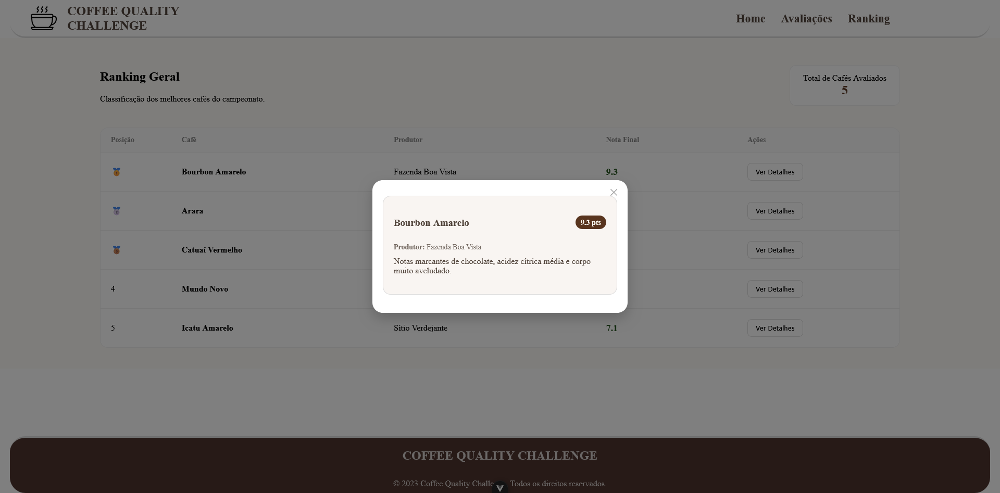
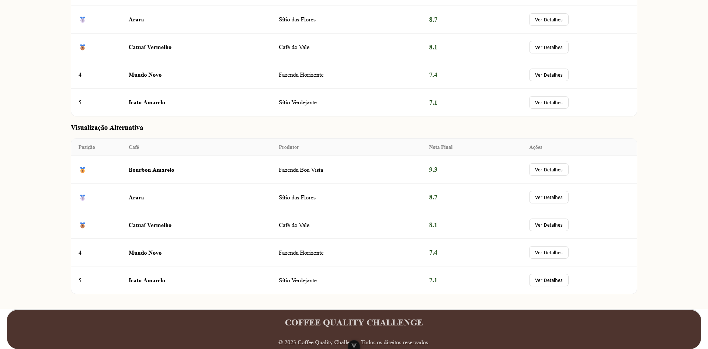
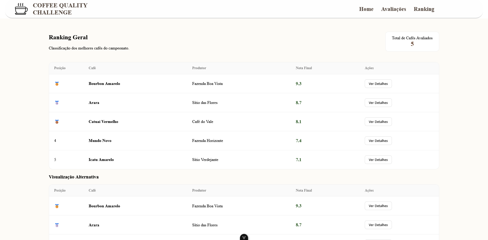
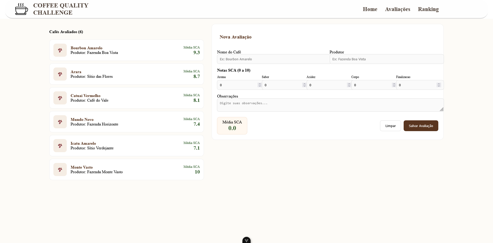
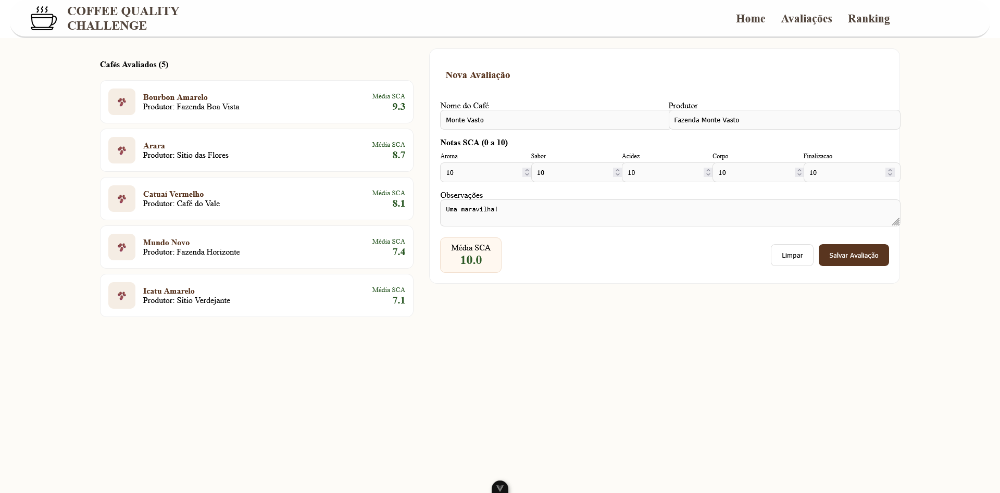
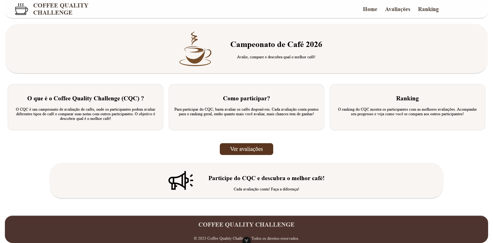

# Trabalho Vue Coffee-Quality-Challenge / Arthur Prants 2info1

Possuo nesse trabalho 5 componentes na pasta src\components\layout, sendo eles:

* AppFooter.vue
* AppHeader.vue
* CoffeCard.vue
* LeaderboardTable.vue
* RatingForm.vue

Possuo um arquivo router na pasta src\router, sendo ele:

* index.js

Possuo 3 páginas na pasta src\views, sendo elas:

* FormularioView.vue
* HomeView.vue
* RankingView.vue

Possuo um componente raiz, sendo ele:

* App.vue

E também possuo pastas separadas com css dentro da pasta assets, sendo elas:

* main.css
* base.css

Uso o componente CoffeCard em um botão de ver detalhes na página RankingView.vue, este é o anexo do CoffeCard funcionando:

Uso o componente LeaderboardTable na página RankingView.vue, este é o anexo do LeaderboardTable sendo usado e a página RankingView.vue funcionando:

Uso o componente RatingForm na página FormularioView.vue, este é o anexo do RatingForm sendo usado e a página RankingView.vue funcionando:

No anexo seguinte apresento a página home do site, no caso sendo o arquivo HomeView.vue:

